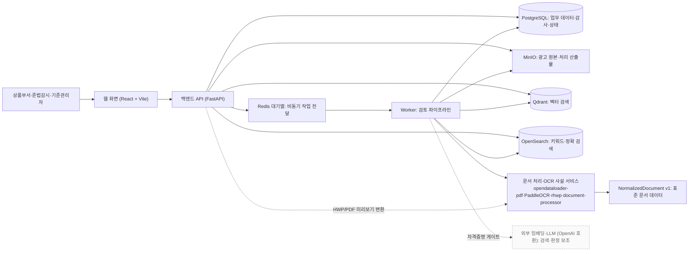

# nh-ad-compliance

NH농협은행 금융상품 광고물의 사전 심의를 보조하는 **AI 기반 광고심의 적정성 검토 에이전트** PoC입니다.
광고 이미지·문서·문구를 입력받아 금융광고 규정 준수 여부를 검토하고, 위반 가능성 표현과 필수 문구 누락을 근거와 함께 제시합니다.

- **핵심 스택:** FastAPI backend · React(Vite) frontend · 비동기 worker(OCR·RAG·LLM) · PostgreSQL · Qdrant(벡터) · OpenSearch(키워드) · Redis(큐/캐시) · MinIO(객체 저장). 전 구성요소 Docker Compose 기반.
- **명세 원천(Source of Truth):** Git으로 관리하는 `docs/`. Notion은 칸반·일정·회의록·공유용 읽기본.
- **작업 시작 전 필독:** [`AGENTS.md`](AGENTS.md) · [`docs/project-rules.md`](docs/project-rules.md) · [`docs/adr/README.md`](docs/adr/README.md)
- **현재 범위:** M0~M8 provider-free thin slice 구현·검증 완료, dev 자동 배포 동작 확인. 실제 OCR/RAG/LLM 품질과 고객 시연·검증은 별도 증거로만 인정([상세](#현재-구현-상태)).

---

## 저장소 구조

```
apps/            backend · frontend · worker · parser-services   (실행 진입점)
packages/        ai-providers · parser-contracts · shared-types  (공용 코드)
docs/            명세·ADR·규정 원본 (Source of Truth) — ↓ 문서 지도
governance/      문서 정책·템플릿 (문서 거버넌스)
scripts/         local-dev.sh · deploy-compose.sh · doc_guard 등
infra/ openapi/  인프라 설정 · OpenAPI 계약(0.8.0)
compose*.yml     공통(compose.yml) + dev(compose.dev.yml) + prod(compose.prod.yml)
```

상세 구성 원칙은 [프로젝트 규칙 §4 Repository 구성](docs/project-rules.md)을 따릅니다.

---

## 아키텍처 구성도

전체 상세 구성도(다이어그램 14종 · 컴포넌트 · 데이터 흐름 · 상태 전이 · 모듈 의존성)는 **[아키텍처 구성도 모음](docs/architecture-overview.md)**에 있습니다. 아래는 전역 개요 1종이며, 런타임 흐름·모듈 의존성·배포·상태 전이 등은 상세 문서를 참고합니다.

> **범례** — 기본색 노드: 기본 compose 구성에서 동작(문서 처리·OCR·규칙 검토 포함) · 회색 점선 노드: 외부 AI(LLM·임베딩·RAG)가 게이트되거나 미구현. 파서/OCR과 외부 AI 활성화는 분리되어 있습니다([ADR-0081](docs/adr/ADR-0081-parser-service-and-external-ai-activation-separation.md)): `NH_PARSER_SERVICES_ENABLED`(기본 `true`) / `NH_EXTERNAL_AI_ENABLED`(기본 `false`).



웹 화면은 백엔드 API로만 호출합니다. 저장소·검색 인프라는 백엔드(업로드 저장·기준자료 색인·검색)와 Worker(검토 처리)가 각자 책임으로 사용하고, 파서·OCR 사설 서비스는 Worker가 문서 파싱에, 백엔드가 HWP/PDF 미리보기 변환에 호출합니다. 파서·OCR는 기본 활성이며, 회색(외부 임베딩·LLM)만 자격증명으로 켜집니다.

런타임 흐름(등록→검토→결과), 코드베이스 모듈 의존성, 배포 구성, 작업 상태 전이, 결과 추적성 다이어그램은 [아키텍처 구성도 모음](docs/architecture-overview.md)에 있습니다.

---

## 온보딩

**사전 요구사항:** Git · Python 3.12 (거버넌스 스크립트) · Bash 및 POSIX 기본 도구(`local-dev.sh` 등 셸 스크립트) · Docker Engine + Compose v2 (스택 실행) · (선택) `uv`, Node.js 22 (품질 검사).

### 1단계 (필수). 저장소 준비 & 문서 거버넌스 설치

가장 먼저 실행합니다. Docker 없이 **Git · Python 3.12 · Bash/POSIX 도구**만 있으면 됩니다. private 저장소이므로 clone 전에 저장소 접근 권한과 GitHub 인증(HTTPS PAT 또는 SSH)이 필요합니다.

```bash
git clone --branch dev https://github.com/CGINSIDE-ROOKIES/nh-ad-compliance.git
cd nh-ad-compliance
scripts/setup-dev-tools.sh
```

`setup-dev-tools.sh`는 이 저장소의 **문서·명세 거버넌스 강제 계층을 부트스트랩**합니다.

- Git `core.hooksPath`를 `.githooks`로 지정 → 커밋·푸시 시 문서 정합성/명세 검사를 **강제**합니다.
- Claude/Codex **Skills adapter**를 저장소 내부(`.agents/skills`, `.claude/skills`)에 설치합니다. 사람이 수정하는 원본은 `skills/`뿐이며 사용자 홈에는 설치하지 않습니다([ADR-0075](docs/adr/ADR-0075-project-scoped-skills-distribution.md)).
- 거버넌스 단위 테스트 + 문서 정합성 + `doc_guard validate`를 실행해 초기 상태를 검증합니다.

> 이 단계를 건너뛰면 로컬 검사와 CI 기준이 어긋나 PR 단계에서 실패합니다. 문서/명세를 바꾸는 모든 작업의 전제 조건입니다.

### 2단계. 로컬 스택 실행 (provider-free)

Docker Compose로 frontend·backend·worker·PostgreSQL·Redis·MinIO·Qdrant·OpenSearch와 parser/OCR 서비스를 띄우고
migration·dev seed까지 적용합니다. 기본값에서 **실제 private Parser/OCR는 실행**되고(`NH_PARSER_SERVICES_ENABLED=true`), **외부 LLM/임베딩(RAG)만 꺼져 있습니다**(`NH_EXTERNAL_AI_ENABLED=false`). 즉 외부 AI API key 없이 스택 전체와 문서 추출·규칙 기반 경로를 실행하며, 실제 AI 검토 판단은 아래 opt-in에서 활성화합니다.

```bash
cp .env.dev.example .env.dev      # .env.dev는 Git 제외. 예제 secret은 개인 로컬 전용
scripts/local-dev.sh up           # 설정 검증 → DB bootstrap → migration → seed → 전체 기동
```

최초 실행은 이미지 빌드로 시간이 걸립니다. 재실행해도 동일 migration·seed를 안전하게 재적용합니다.

**접속 주소**

| 대상 | 로컬 | dev 배포 |
| --- | --- | --- |
| 웹 화면 | <http://localhost:5173> | **<https://nh-compliance.ihopper.co.kr>** |
| Backend health / OpenAPI | `:8000/health` · `:8000/openapi.json` | 내부망 전용 |
| Worker readiness | `:8001/ready` | 내부망 전용 |
| MinIO console | `:9001` | 내부망 전용 |
| parser/OCR health | `:8091`~`:8094/health` | Compose 네트워크 내부 전용 |

> 브라우저는 CORS/refresh-cookie 기준과 맞도록 `127.0.0.1`이 아니라 `localhost`를 사용합니다.

**기본 로그인 계정** (synthetic, 로컬 전용)

| 계정 | 이메일 | 비밀번호 | 용도 |
| --- | --- | --- | --- |
| 업무·기준자료 | `test@ihopper.co.kr` | `Testihopper12#$` | 광고 등록·AI 검토·기준자료 관리 |
| 시스템 관리자 | `admin@ihopper.co.kr` | `Testihopper12#$` | 사용자·권한·감사·운영 확인 |

**운영 명령**

```bash
scripts/local-dev.sh status               # 상태 확인
scripts/local-dev.sh logs [service...]     # 로그
scripts/local-dev.sh down                  # 중지 (volume 보존)
scripts/local-dev.sh reset                 # volume 삭제 후 빈 DB로 재기동
```

<details>
<summary><b>실제 AI 결과 확인 (OpenAI/vLLM opt-in)</b></summary>

기본 경로에서도 private Parser/OCR는 실행되며, 외부 LLM/임베딩만 꺼져 있습니다. 실제 **RAG·LLM 기반 검색·판단**을 보려면 **현재 저장소의 승인 샘플 자료만** 사용해 opt-in합니다
([ADR-0002](docs/adr/ADR-0002-customer-sample-data-ai-input-policy.md) 범위 — 신규/운영/민감 자료 업로드 금지).

1. `.env.dev`에 `NH_EXTERNAL_AI_ENABLED=true`, `NH_PARSER_SERVICES_ENABLED=true`, `OPENAI_API_KEY=...` 등 설정 (예제 주석 참고).
2. `scripts/local-dev.sh up` 후 `scripts/ingest-reference-regulations.sh`로 승인 규정·가이드라인 적재.
3. <http://localhost:5173>에서 `test@ihopper.co.kr` 로그인 → 광고 등록 → PDF/PNG/JPEG/HWP/HWPX 업로드 → AI 검토 → 결과 확인. 샘플: `docs/광고예시/`.

- 키워드(OpenSearch)+벡터(Qdrant) 검색이 모두 성공해야 근거를 반환하며, 실패 시 `SEARCH_UNAVAILABLE`로 명시(우회 없음).
- 외부 AI를 켜지 않은 기본(provider-free) 상태에서는 Parser/OCR·규칙 경로가 실행되고 외부 검색·LLM 판단만 수행되지 않으며, **검토 흐름 자체는 정상 완료**됩니다. 반면 `NH_EXTERNAL_AI_ENABLED=true`인데 필수 key·model이 없으면 worker가 시작 단계에서 설정 오류(`OPENAI_*_NOT_CONFIGURED`)로 실패합니다.
- 폐쇄망 vLLM 전환: `OPENAI_BASE_URL`/`EMBEDDING_BASE_URL`을 내부 endpoint로. 임베딩 **endpoint·model·dimension** 중 하나라도 바뀌면 기존 벡터와 호환되지 않으므로 새 `QDRANT_COLLECTION`을 지정하고 전체 재색인이 필요합니다.

</details>

<details>
<summary><b>문제 해결</b></summary>

- **포트 충돌:** `.env.dev`의 `FRONTEND_PORT`/`BACKEND_PORT` 변경. 프론트/백 포트 변경 시 `CORS_ALLOWED_ORIGINS`·`VITE_API_BASE_URL`도 함께.
- **OpenSearch 미기동(Linux):** `sudo sysctl -w vm.max_map_count=262144` 후 재실행.
- **DB/DSN 불일치:** `POSTGRES_DB` 변경 시 `NH_DB_RUNTIME_URL`·`NH_DB_MIGRATION_URL`의 database 이름도 동일하게.
- **unhealthy:** `scripts/local-dev.sh status` · `logs <service>`로 확인.
- **처음부터 재현:** `scripts/local-dev.sh reset`.

</details>

---

## 환경 변수

환경별 예제 파일을 복사해 사용하며, 실제 값이 든 `.env*`는 Git에 커밋하지 않습니다.

| 파일 | 환경 | 용도 |
| --- | --- | --- |
| `.env.dev.example` | 로컬 / 공용 dev VM | 로컬 개발·dev 배포. 포트·bind·parser/AI opt-in 포함 |
| `.env.prod.example` | production | 운영 기준. 실제 값은 runner 밖 권한 제한 경로(`0600`)에 보관 |
| `.env.example` | 공통 참고 | 공통 키 레퍼런스 |

- **공용 개발 VM**은 `compose.prod.yml` runtime(Nginx 정적 번들 + production image)으로 실행하고, Vite/hot-reload인 `compose.dev.yml`은 **로컬 전용**입니다.
- reverse proxy가 VM 사설망에서 접속하면 `FRONTEND_BIND_ADDRESS=<VM 사설 IP>` 설정. backend·DB·parser 포트는 노출하지 않습니다.
- 주요 그룹: DB(`NH_DB_*`,`POSTGRES_*`) · 인증(`JWT_SECRET`,`CORS_ALLOWED_ORIGINS`,`REFRESH_COOKIE_SECURE`) · 스토리지(`MINIO_*`,`*_BUCKET`) · 검색(`QDRANT_COLLECTION`,`OPENSEARCH_INDEX`) · Redis(`REDIS_*_PREFIX`) · AI opt-in(`NH_EXTERNAL_AI_ENABLED`,`OPENAI_*`,`EMBEDDING_*`).

상세 기준: [프로젝트 규칙 §8 개발 환경·인프라](docs/project-rules.md) / [ADR-0063 Compose 구성](docs/adr/ADR-0063-compose-base-dev-prod-override-policy.md).

---

## 배포 구조

Git이 코드와 배포 구성의 단일 원천입니다. 배포는 self-hosted Compose CD로 수행합니다([ADR-0080](docs/adr/ADR-0080-self-hosted-runner-compose-cd-policy.md), [runner 가이드](docs/self-hosted-runner-guide.md)).

| 환경 | 트리거 | runner | 대상 |
| --- | --- | --- | --- |
| **development** | `dev` push → Product CI 성공 시 `workflow_run` **자동 배포** (수동 `workflow_dispatch`도 지원) | self-hosted 조직 러너 (`org-cg-rookies`·`org-deploy`) | 공용 dev VM → **<https://nh-compliance.ihopper.co.kr>** |
| **production (외부, 향후)** | 비활성 코드 스켈레톤 — 실행 금지 (아래 설명) | `org-deploy` 라벨 (전용 env 경계 미구현) | 향후 외부 prod 서버 |
| **NH 내부망 반입** | 승인된 **수동 반입** (자동 배포 아님) | — (러너 미사용) | **NH농협은행 내부망(폐쇄망)** |

- **CI/CD 실행 환경:** Product CI(`ci.yml`)·provider-free 릴리스 게이트(`release-readiness.yml`)·배포(`deploy-compose.yml`)는 **조직 공유 self-hosted 러너**(`org-ci`·`org-build`·`org-deploy`)에서 실행합니다. 문서 거버넌스(`document-governance.yml`)·Notion 동기화(`notion-docs-publish-test.yml`)·외부 AI 평가(`external-ai-evaluation.yml`)는 GitHub-hosted `ubuntu-latest`에서 실행합니다.
- **dev 자동 배포 (운영 중):** 기본 브랜치가 `dev`이고 `org-deploy` 러너가 등록되어, `dev` push → Product CI 성공 시 `deploy-compose.yml`이 `workflow_run`으로 **자동 배포**됩니다. 배포는 SSH release 방식(릴리스 디렉터리 + `app` 심링크 교체, commit SHA 이미지 태그 기반 롤백)이며, 최근 병합이 dev VM에 정상 자동 배포됨을 확인했습니다. 세부 절차는 [배포 runner 가이드](docs/self-hosted-runner-guide.md)를 따릅니다.
- `main`은 향후 **폐쇄망 반입 릴리스 기준선**으로 사용할 예정입니다. `dev`→`main` 병합은 운영 자동배포가 아니라 버전 태그와 반입 후보 확정을 의미하며, 오프라인 번들·SBOM·SHA-256 checksum 자동 생성과 production 배포 파이프라인은 **반입 절차 확정(Q77) 후 구현**합니다. 실제 NH 내부망 배포는 승인된 수동 반입으로 수행합니다(운영은 release tag/commit SHA만 사용, `latest` 금지).
- **production 폐쇄망 제약:** 외부 인터넷·public 레지스트리에 접근할 수 없으므로 생성 LLM·임베딩은 내부 vLLM 등 폐쇄망 endpoint로 전환하고([2단계 opt-in 참고](#온보딩)), 이미지·의존성은 사전 반입한 내부 자산만 사용합니다. 세부 전략은 ADR 후보(Q76 결정·Q77 보류)로 정리 중입니다.

---

## 개발 기여

### 이슈·작업 관리
- **GitHub Issue**로 작업 이력을 관리하는 것을 팀 운영 방침으로 합니다. 기능·수정·문서·운영 작업은 가급적 착수 전 Issue로 등록해 논의·결정·변경 이력을 남깁니다.
- **이슈 제목은 커밋·PR과 동일한 형식**입니다: `<type>: <한글 요약>` (소문자 type, scope·`[BUG]` 같은 대괄호 접두어 없음, 종결 어미 없음). 결함은 `fix`, 운영 장애는 `hotfix`. 예: `fix: 검토 결과 화면 근거 하이라이트 누락`. 결함 이슈에는 재현 절차·기대/실제 동작·확인 환경(위치·commit)을 적습니다 — [`.github/ISSUE_TEMPLATE`](.github/ISSUE_TEMPLATE) 템플릿이 항목을 안내합니다.
- **Notion 칸반을 운영하는 경우** 해당 카드에 Issue **링크**를 남겨 진행 상황(스프린트·Epic·마일스톤)을 관리합니다. 보드 구성은 [개발 일정 및 Notion 칸반](docs/development-schedule-and-notion-kanban.md)을 따릅니다.
- 브랜치·PR에 Issue를 연결하는 것을 권장합니다: 브랜치 `<type>/<issue-number>-<short-description>` 또는 `<type>/<short-description>`, PR 본문에 `#<issue-number>` 참조. (명명 규칙 원문은 [프로젝트 규칙 §11.3](docs/project-rules.md))
- 착수 전 관련 명세와 Accepted ADR을 확인합니다.

### 브랜치·PR 흐름

| 변경 | 흐름 | 병합 |
| --- | --- | --- |
| 기능·수정·리팩터링·테스트·설정·CI | `feat/*`·`fix/*`·`refactor/*`·`test/*`·`chore/*`·`ci/*` → `dev` | Squash |
| 문서 | `docs/*` → `dev` | Squash |
| 릴리즈 | `dev` → `main` (+ `vX.Y.Z` tag) | Merge commit |
| 긴급 | `hotfix/*` → `main` → `dev` 역반영 | Merge commit |

- `main`·`dev`는 보호 대상 브랜치 — **팀 정책상** 직접 push·force push·삭제 금지, PR + CI + 최소 1명(권장 2명) 승인 필수. (실제 GitHub branch protection 적용 여부는 저장소 플랜·설정에 따름)
- 브랜치: `<type>/<short-description>` 또는 `<type>/<issue-number>-<short-description>` (prefix는 커밋·PR과 같은 type, `feature/*`는 `feat/*` 별칭, 운영 긴급 수정만 `main`에서 분기하는 `hotfix/*`). 커밋: `<type>: <한글 요약>` (Conventional Commits, type: `feat|fix|hotfix|refactor|docs|test|chore|ci`).
- PR 본문은 [`pull_request_template.md`](.github/pull_request_template.md) 체크리스트(API 계약·문서 정합성·AI 산출물·배포/롤백)를 채웁니다.

### 완료 전 검사

```bash
# 문서 거버넌스 (필수) — Git hook과 CI가 동일 기준으로 강제
python3 -m scripts.doc_guard impact --scope working     # 동기화 대상 확인
scripts/check-doc-consistency.sh
python3 -m scripts.doc_guard validate --scope working

# CI와 가까운 품질 검사 (최초 1회 의존성 설치 필요)
uv sync --all-packages --dev && npm ci --ignore-scripts && npm --prefix apps/frontend ci
uv run ruff check . && uv run ruff format --check apps/backend apps/worker scripts/ci scripts/check_environment_isolation.py tests/ci tests/integration && uv run mypy
uv run python -m pytest -m "not external_ai and not slow"
npm run openapi:check
npm --prefix apps/frontend run lint && npm --prefix apps/frontend run typecheck && npm --prefix apps/frontend run test && npm --prefix apps/frontend run build
```

전체 규칙은 [프로젝트 규칙](docs/project-rules.md)의 §10 CI/CD · §11 브랜치·PR · §12 ADR을 따릅니다.

---

## 문서 & 거버넌스

`docs/`가 명세 원천이며, 게시 대상 Markdown은 ADR-0077에 따라 Notion 공유본으로 단방향 자동 동기화됩니다. **자동 동기화 트리거는 `dev` 기준**입니다(ADR-0083 전환 완료). 자동 동기화는 신규 페이지를 만들지 않으므로(ADR-0077), 신규 문서는 **작업 브랜치에서 단건 `allow_create`로 페이지를 만들고 artifact의 page ID를 같은 브랜치 page-map에 확정한 뒤 병합**합니다(프로젝트 규칙 §5.4). 현재 page-map은 게시 대상 전부가 등록된 상태(`page_id` null 0건)입니다. Git의 `docs/`가 항상 Source of Truth이며 Notion은 공유용 읽기본입니다.
문서·구현 변경 시 같은 작업 단위에서 관련 명세를 함께 갱신합니다([문서 거버넌스 가이드](governance/README.md), [ADR-0076](docs/adr/ADR-0076-ai-tool-lifecycle-hook-enforcement-policy.md)).

### 문서 지도

| 문서 | 주요 내용 |
| --- | --- |
| [요구사항 정의서](docs/requirements-definition.md) | 목적·범위·사용자·업무/기능/데이터/비기능 요구사항·수용 기준 |
| [기능명세서](docs/functional-specification.md) | 화면별 기능·입출력·처리 규칙·예외·권한 |
| [화면설계서](docs/screen-specification.md) | 메뉴·화면 구성·이동 흐름·팝업·메시지 |
| [화면-API 매핑표](docs/screen-api-mapping.md) | 화면별 호출 API·시점·요청/응답 |
| [API 명세서](docs/api-specification.md) | 설계 원칙·공통 규격·엔드포인트·모델 |
| [API 계약 동기화 기준](docs/api-contract-sync-policy.md) | OpenAPI·명세·구현·생성 타입 동기화 절차 |
| [DB 명세서](docs/database-specification.md) | ERD·테이블·인덱스·보관 정책·Qdrant/OpenSearch |
| [테스트케이스](docs/test-cases.md) | 정상/예외/권한/비기능/E2E·완료 기준 |
| [프로젝트 규칙](docs/project-rules.md) | 개발 방식·AI 활용·저장소·문서·TDD·CI/CD·브랜치/PR·ADR |
| [아키텍처 구성도 모음](docs/architecture-overview.md) | 구성 다이어그램·데이터 흐름·책임 경계·구현 상태(dev 기준) |
| [CI·배포 가이드](docs/self-hosted-runner-guide.md) | CI 실행 환경·배포 runner·Environment·rollback |
| [의사결정 필요사항](docs/adr-candidates.md) | ADR 기준·미결정 항목 |
| [개발 일정 및 Notion 칸반](docs/development-schedule-and-notion-kanban.md) | 로드맵·스프린트·Epic·마일스톤·리스크 |
| [위험도 산정 기준표](docs/risk-assessment-criteria.md) · [KPI 산식](docs/poc-kpi-formulas.md) · [평가 제외 기준](docs/poc-evaluation-exclusion-criteria.md) · [참조 레포](docs/reference-repositories.md) | PoC 평가·참고 자료 |

**작업 목적별 우선 참조**

| 작업 | 우선 확인 |
| --- | --- |
| 신규 기능 정의 | 요구사항 → 기능명세 → 테스트케이스 |
| 화면 구현/수정 | 화면설계서 → 화면-API 매핑표 → 기능명세 |
| API 구현/수정 | API 명세 → 화면-API 매핑표 → DB 명세 → 테스트케이스 |
| DB/검색 구조 변경 | DB 명세 → API 명세 → 의사결정 필요사항 |
| AI 검토/RAG | 요구사항 → 기능명세 → DB 명세 → 테스트케이스 |
| 테스트 작성/검수 | 테스트케이스 → 기능명세 → API 명세 |

> 활성 Markdown 파일명은 영문 kebab-case. 파일 경로 변경 시 저장소 전체의 링크·자동화를 같은 변경에서 갱신합니다.

---

## 현재 구현 상태

M0~M8 provider-free thin slice가 실제 backend/worker/frontend 경로와 결정적 fixture 기준으로 구현·검증되었습니다.
dev 공용 VM 자동 배포는 동작을 확인했으나, provider-free 성공은 실제 OCR/RAG/LLM 품질, 고객 시연·검증, 결함 0건을 대신 증명하지 않으며, 해당 항목은 증거가 생길 때까지 일정/칸반에서 `Backlog`/`Blocked`로 유지합니다.

| 구분 | 기준 |
| --- | --- |
| provider-free 자동 Gate | `.github/workflows/release-readiness.yml`, `governance/goal-manifests/G009-m8-release.json`, 고정 fixture E2E |
| 실제 외부 AI 수동 평가 | `.github/workflows/external-ai-evaluation.yml` 승인 `workflow_dispatch`(credential + `external_ai` marker) |
| Production recovery | `bash scripts/release-smoke.sh --env-file .env.prod.example --fresh-project --with-restart-and-outages` |

---

## 원본 자료

`docs/규정 및 가이드라인/`, `docs/광고예시/`, `docs/계획서/`에 광고심의 규정·예시 광고물·사업 계획 원본이 있습니다.
요구사항·기능명세 검증과 AI 검토 기준 보강에 참고합니다.
