# 아키텍처 구성도 모음

## AI 활용 금융상품 광고심의 적정성 검토 에이전트 — 개발자 온보딩용 구성도

이 프로젝트에 새로 참여해 도메인과 코드 구조를 처음 접하는 개발자를 위한 다이어그램 중심 자료입니다. 전체 구조·데이터 흐름·책임 경계·구현 상태를 한눈에 검토합니다.

## 문서 현행 정보

| 항목 | 내용 |
| --- | --- |
| 현행 버전 | v0.1 |
| 기준일 | 2026-07-27 |
| 기준 소스 | `dev` 브랜치 `43c11a5` 스냅샷 (dev가 GitHub 기본 브랜치, ADR-0082) |
| 기준 문서 | `README.md`, `compose*.yml`, 기능·API·DB 명세, 채택된 ADR |
| 유의사항 | 외부 OCR·RAG·LLM 품질과 고객사 환경 배포는 별도 검증 대상. Notion 공유본 페이지는 이 브랜치에서 단건 `allow_create`로 등록 완료(Git `docs/`가 원천) |

## 변경 이력

| 버전 | 기준일 | 변경 내용 |
| --- | --- | --- |
| v0.1 | 2026-07-27 | dev `43c11a5` 기준 아키텍처 구성도 최초 작성 (다이어그램 14종·컴포넌트·데이터 흐름·상태 전이·모듈 의존성) |

## 범례 (모든 다이어그램 공통)

- 기본색·실선 노드 — 기본 compose 구성에서 동작 (문서 처리·OCR·규칙 검토 포함)
- 회색 점선 노드 — 기본 비활성: 외부 AI(LLM·임베딩·RAG 하이브리드 검색)가 `NH_EXTERNAL_AI_ENABLED`(기본 `false`)·자격증명으로 게이트되거나, 아직 미구현(MinerU·VLM OCR·`CANCELED`)

> 화살표(선)의 의미는 다이어그램마다 다르므로 각 그림 아래 **선 읽기**에서 안내.
> dev는 두 활성화 플래그를 분리한다(ADR-0081): `NH_PARSER_SERVICES_ENABLED`(기본 `true`, 사설 파서·OCR)와 `NH_EXTERNAL_AI_ENABLED`(기본 `false`, 외부 LLM·임베딩·RAG). 따라서 외부 AI가 꺼져 있어도 파서·OCR·결정적 규칙 검토는 기본 동작한다.

---

## 1. 한눈에 보는 구조와 구현 경계

- **이 그림은** — 사용자부터 저장소·Worker·외부 엔진까지 전체 구성과 데이터 흐름 (회색은 기본 비활성 경계)

- 광고물을 등록하면 Worker가 비동기로 검토 수행
- 기준자료 검색 결과에 규칙·AI 판단을 결합하여 근거가 포함된 결과 제공
- 웹 화면은 백엔드 API로만 호출하며, Redis·PostgreSQL·MinIO·검색 인프라에는 직접 접근하지 않음
- 문서 처리·OCR 실엔진과 결정적 규칙 검토는 기본 동작(`NH_PARSER_SERVICES_ENABLED=true`)
- 하이브리드 검색과 외부 LLM은 구현되어 있으나 `NH_EXTERNAL_AI_ENABLED`·자격증명으로 게이트되어 기본은 비활성

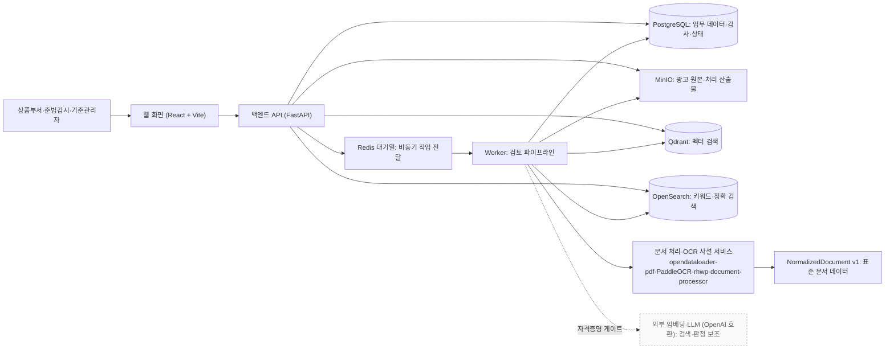

- **여기서 볼 것** — 웹 화면은 API 한 곳으로만 나감 · 저장소·검색 인프라는 백엔드(업로드 저장·기준자료 색인·검색)와 Worker(검토 처리)가 각자 책임으로 사용 · 파서·OCR는 기본 활성, 회색(외부 임베딩·LLM)만 자격증명으로 켜지는 경계
- **선 읽기** — 실선: 기본 구성에서 동작하는 연결 / 점선: `NH_EXTERNAL_AI_ENABLED`·자격증명으로 활성화되는 연결

| 구분 | dev 현재 상태 (기본 구성) | 활성화 조건 |
| --- | --- | --- |
| 작업 처리·상태 기록 | Redis 소비, PostgreSQL 작업·단계 상태와 검토 결과 저장, MinIO 원본·파서 원시 산출물 저장 — 기본 동작 | 없음 |
| 문서 처리·OCR + 규칙 검토 | 실엔진 4종을 사설 서비스로 구현(opendataloader-pdf·PaddleOCR·rhwp·document-processor), HWP/HWPX 하이브리드(ADR-0079). 기본 활성(`NH_PARSER_SERVICES_ENABLED=true`)으로 `NormalizedDocument v1` 정규화·결정적 규칙 검토까지 동작 | 명시 비활성 시 `PARSER_ADAPTER_NOT_CONFIGURED` (fail-closed) |
| RAG 검색 | Qdrant 벡터 + OpenSearch 키워드를 RRF로 융합하는 하이브리드 검색 구현. 기본은 검색기 미구성 → 근거 상태 `INSUFFICIENT`(검색 호출 자체 없음). 구성 후 검색 장애 시에만 `SEARCH_UNAVAILABLE` | `NH_EXTERNAL_AI_ENABLED=true` + 임베딩 자격증명 |
| 임베딩 | OpenAI 호환 임베딩 공급자(`packages/ai-providers`) 구현 | 위 조건 + `OPENAI_EMBEDDING_MODEL`·키 설정 |
| 외부 LLM | OpenAI Responses 공급자(판정·보완 문구) 구현, 규칙 결과에 대한 보조(advisory) | 위 조건 + `OPENAI_API_KEY`·`OPENAI_MODEL` |
| MinerU·VLM OCR | 라우팅 후보로만 명명, 아직 미구현·미등록 | (목표) |

### 책임 분리

| 구성요소 | 주 책임 | 직접 접근 금지 경계 |
| --- | --- | --- |
| 웹 화면 | 사용자 입력, 진행 상태·결과 표시 | Redis, PostgreSQL, MinIO, 검색 인프라 |
| 백엔드 | 인증·인가, API, 트랜잭션, 작업 생성·조회, 업로드 객체 저장(MinIO), 기준자료 색인·검색(Qdrant·OpenSearch) | OCR·LLM 장시간 처리 직접 수행 |
| Worker | 대기열 소비, 파서 서비스 호출, 하이브리드 검색 호출, **내부 규칙 엔진 판정**, 외부 LLM 보조 판정 요청, 결과 저장 | 사용자 브라우저에 직접 응답, 문서 처리·OCR 자체 수행(사설 서비스에 위임) |
| PostgreSQL | 업무 원천 데이터, 검토 이력, 작업·단계 상태, 감사 로그 | 대기열의 실시간 전달 역할 |
| Redis | 최소 식별자 기반 작업 전달·대기열 | 장기 상태·감사의 원천 |
| MinIO | 원본 광고물, 문서 처리 원시 산출물 저장 (리포트 파일 저장은 미구현) | 업무 상태·검색 인덱스의 원천 |
| Qdrant/OpenSearch | 기준자료 검색용 인덱스 | 최종 검토 이력의 원천 |
| 사설 파서·OCR 서비스 | 파일 유형별 실제 문서 처리·OCR (HTTP `/v1/parse`). Worker는 문서 파싱, 백엔드는 HWP/PDF 미리보기 변환으로 호출 | 업무 상태·검토 이력의 원천, 규칙 판정 |

---

## 2. Docker Compose 배포 관점

- **이 그림은** — 하나의 Git 소스가 로컬 개발 구성과 런타임 프로필(공용 개발 VM 배포) 두 실행 방식으로 갈라지는 모습

- 공통 `compose.yml`이 서비스와 상태 확인(health check)을 정의
- `compose.dev.yml`은 로컬 개발 전용(소스 연결·자동 새로고침), `compose.prod.yml`은 빌드 이미지·정적 번들로 실행하는 런타임 프로필
- 공용 개발 VM은 `compose.yml`+`compose.prod.yml` 런타임 프로필로 `dev` push 후 SSH release 자동 배포(ADR-0080). `main`은 자동 배포 대상이 아니라 폐쇄망 반입 릴리스 기준선(ADR-0082, 반입 전략은 Q77 결정 대기)
- 임베딩·LLM은 별도 로컬 서비스가 아니라 환경변수로 지정하는 외부 OpenAI 호환 엔드포인트

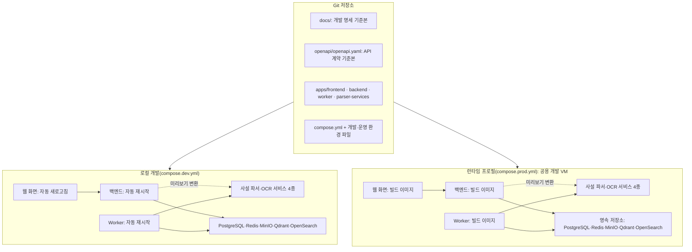

- **여기서 볼 것** — 하나의 소스에서 로컬 개발/런타임 프로필로 분기 · 웹→API→데이터 방향은 동일하고 실행 방식만 다름 · 사설 파서·OCR 서비스는 로컬 개발과 런타임 프로필 모두에서 함께 기동
- **선 읽기** — 실선: 배포·환경 내부 호출 방향 / 점선: 백엔드의 파서 미리보기 변환 호출

- 환경별로 데이터베이스·버킷·검색 인덱스·Redis 접두사·Compose 프로젝트 이름 분리
- `NH_PARSER_SERVICES_ENABLED`는 기본 `true`, `NH_EXTERNAL_AI_ENABLED`는 기본 `false`. 비밀값·플래그·OpenAI 자격증명은 `.env.dev`·`.env.prod` 등 Git 비추적 환경 파일이나 배포 비밀값으로 주입
- 런타임 프로필(`compose.prod.yml`)은 파서 서비스 중 `document-processor`만 재정의하고 나머지 3종은 기본 파일 정의를 사용

### 2.1 상세 컨테이너 구성과 기동 순서

- **이 그림은** — 컨테이너별 기동 조건(`depends_on`)과 기동 후의 런타임 연결·볼륨 (dev 기준 14개 서비스)

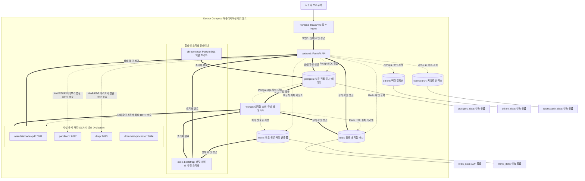

- **여기서 볼 것** — backend·worker 모두 PostgreSQL·Redis 상태 확인과 `minio-bootstrap`·**파서 서비스 4종 health**를 기다린 뒤 기동 · worker는 문서 파싱을, backend는 HWP/PDF **미리보기 변환**을 각각 파서 서비스에 HTTP로 호출 · 파서 서비스는 기본 활성(`NH_PARSER_SERVICES_ENABLED=true`)이며 런타임 프로필에서도 함께 기동 · 모든 서비스가 `${COMPOSE_PROJECT_NAME}-application` 네트워크 공유
- **선 읽기** — 굵은 실선(`==>`): `depends_on` 기동 조건 / 점선(`-.->`): 기동 후 런타임 연결 / 실선(`---`): 볼륨 마운트

| 서비스 | Compose 기동 기준 | 로컬 개발(`compose.dev.yml`) | 런타임 프로필(`compose.prod.yml`) |
| --- | --- | --- | --- |
| `frontend` | `backend` 상태 확인 후 | `5173` 노출, 소스 연결, 자동 새로고침 | `8080` 노출, 자동 재시작, 128MB |
| `backend` | PostgreSQL·Redis·**파서 4종** 상태 확인, `minio-bootstrap` 완료 후 | `8000` 노출, 소스 연결, 자동 재시작 | `8000` 노출, 자동 재시작, 512MB |
| `worker` | PostgreSQL·Redis·**파서 4종** 상태 확인, `minio-bootstrap` 완료 후 | `8001` 노출, 소스 연결, 자동 재시작 | 외부 포트 없음, 자동 재시작, 1GB |
| `opendataloader-pdf` | 독립 기동, HTTP 상태 확인 | `8091` 노출 | 기본 파일 정의 사용 |
| `paddleocr` | 독립 기동, HTTP 상태 확인 | `8092` 노출 | 기본 파일 정의 사용 |
| `rhwp` | 독립 기동, HTTP 상태 확인 | `8093` 노출 | 기본 파일 정의 사용 |
| `document-processor` | 독립 기동, HTTP 상태 확인 | `8094` 노출 | 런타임 프로필 override 포함 |
| `postgres` | `db-bootstrap` 완료 후 | `5432` 노출 | 외부 포트 없음, 자동 재시작, 1GB |
| `redis` | 독립 기동, AOF 볼륨 사용 | `6379` 노출 | 외부 포트 없음, 자동 재시작, 512MB |
| `minio` | 독립 기동 후 `minio-bootstrap` 실행 | API `9000`, 콘솔 `9001` 노출 | 외부 포트 없음, 자동 재시작, 512MB |
| `qdrant` | 독립 기동, TCP 상태 확인 | `6333` 노출 | 외부 포트 없음, 자동 재시작, 1GB |
| `opensearch` | 독립 기동, 클러스터 상태 확인 | `9200` 노출 | 외부 포트 없음, 자동 재시작, 2GB |

- `minio-bootstrap`은 광고 원본·문서 처리 산출물 버킷과 서비스 계정 권한을 초기화
- 기준자료·리포트 버킷의 실제 생성·권한 범위는 이관 환경에서 확인 필요

---

## 3. 광고물 등록부터 결과 확인까지 (런타임 흐름)

- **이 그림은** — 광고물 등록부터 검토 결과 확인까지의 시간순 흐름

- API는 오래 붙잡지 않고 `reviewId`·`jobId`를 먼저 반환
- 진행 상태의 기준 데이터는 Redis가 아닌 PostgreSQL
- 기본 구성에서 파서·OCR + 결정적 규칙 검토까지 동작(`NH_PARSER_SERVICES_ENABLED=true`)
- RAG 근거 검색과 LLM 판정·문구 보강은 `NH_EXTERNAL_AI_ENABLED=true` + 자격증명이 있을 때만 채워짐
- 파서 서비스를 명시적으로 끄면 빈 라우터로 인해 `PARSER_ADAPTER_NOT_CONFIGURED`로 안전하게 실패

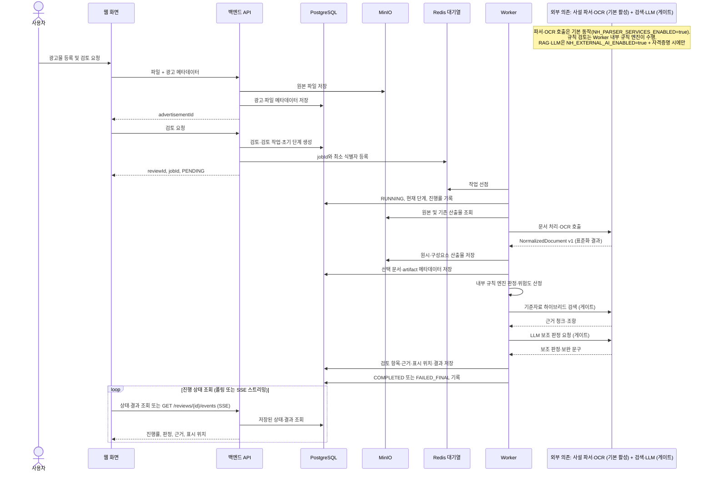

- **여기서 볼 것** — 등록·검토 요청은 즉시 응답(동기) · 실제 검토는 Worker가 뒤에서 수행(비동기) · 화면은 PostgreSQL 상태를 폴링하거나 SSE(`streamReviewProgress`)로 변경분만 수신 · 파서·OCR는 기본 동작, `engines`의 RAG·LLM만 게이트 경로 · 산출물·선택 문서는 **판정 이전에** 영속화되어 중간 장애 분석과 stale replay의 멱등성 기준으로 남는다. stale replay는 원본에서 파싱을 다시 수행하고, 동일한 artifact·checkpoint이면 기존 영속 결과에 멱등 수렴한다
- **선 읽기** — 실선: 요청 / 점선(`-->>`): 응답
- SSE 엔드포인트는 초기 스냅샷과 변경분만 전송하며 진행 상태의 원천은 여전히 PostgreSQL

### 작업 상태 전이

- **이 그림은** — 작업(`jobId`)이 거치는 상태와 전이 조건

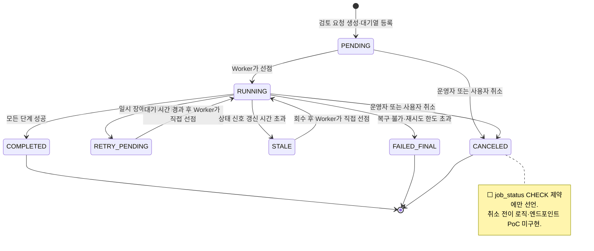

- **여기서 볼 것** — 정상 경로는 `PENDING→RUNNING→COMPLETED` · 실패는 일시(`RETRY_PENDING`)와 영구(`FAILED_FINAL`)로 구분 · `RETRY_PENDING`·`STALE`은 `PENDING`을 거치지 않고 Worker 선점 시 곧바로 `RUNNING`으로 전이 · `CANCELED`는 계약상 선언만 있고 아직 미구현
- 재시도 제외 대상: 파일 손상, 미지원 형식, OCR 판독 불가, 상품 조건 불명확, 기준자료 미제공, 권한·입력 오류
- 이 경우 기록 상태는 축을 나눠 읽는다 — 성공 종료: job `COMPLETED` + review `REVIEW_COMPLETED` 또는 `CHECK_REQUIRED` / 영구 실패: job `FAILED_FINAL` + review `REVIEW_FAILED`

---

## 4. 문서 처리·OCR 교체 구조

- **이 그림은** — 어떤 파일이든 단일 표준(`NormalizedDocument v1`)으로 변환한 뒤 이후 단계에 전달하는 구조 (엔진을 교체해도 뒷단에 영향 없음)

- 검토·검색·화면 코드는 특정 엔진의 원시 결과를 직접 읽지 않음
- `ParserRouter`가 파일 유형별로 사설 파서 서비스를 HTTP 호출하고 `NormalizedDocument v1` 반환
- HWP/HWPX는 `rhwp`(정본 텍스트) + `document-processor`(구조) 하이브리드로 결합 (ADR-0079, ADR-0072 대체)

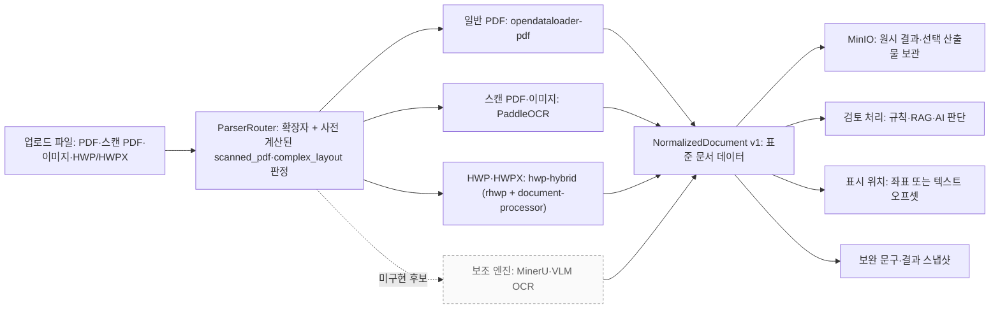

- **여기서 볼 것** — 1차 엔진(opendataloader-pdf·PaddleOCR·hwp-hybrid)은 사설 서비스로 구현 · MinerU·VLM OCR(회색)은 라우팅 후보로만 명명되고 아직 미구현 · 표준 데이터 하나에서 산출물·검토·표시 위치·결과 스냅샷이 갈라짐
- **선 읽기** — 실선: 표준화 데이터 흐름 / 점선: 아직 붙지 않은 보조 엔진 후보
- 라우팅·호출은 기본 활성(`NH_PARSER_SERVICES_ENABLED=true`)이며 외부 AI와 무관하게 동작 (ADR-0081). 명시적으로 끄면 빈 라우터 → `PARSER_ADAPTER_NOT_CONFIGURED` fail-closed

| 입력 유형 | 1차 엔진 | 보조/후보 | 현재 주의점 |
| --- | --- | --- | --- |
| 일반 PDF | `opendataloader-pdf` | `MinerU`(미구현) | 실제 샘플 품질 검증 필요 |
| 스캔 PDF, JPG/JPEG/PNG | `PaddleOCR` | `VLM OCR`(미구현, 외부 AI 허용 시) | OCR 품질·GPU·온프렘 검증 필요 |
| HWP/HWPX | `hwp-hybrid` = `rhwp`(텍스트) + `document-processor`(구조) | — | 구조 정렬·오프셋 안정성 검증 필요 |

- 보조 엔진으로 자동 전환하지 않음, 미등록 후보는 조용히 건너뜀
- 재처리 조건: 엔진 장애·구조 인식 실패 (HWP 하이브리드 구성요소, `structure_attempts` 한도 내). 낮은 신뢰도(`confidence.status != READABLE`)는 재처리가 아니라 검토를 `CHECK_REQUIRED`로 표시
- 최종 산출물의 선택 근거 저장
- HWP 하이브리드는 구성요소 문서를 각각 별도 산출물로 저장
- `NormalizedDocument v1` 구성: 페이지·텍스트 블록·레이아웃·표·좌표·신뢰도·경고

---

## 5. 기준자료 적재와 하이브리드 검색

- **이 그림은** — 기준자료 등록부터 검색 가능 상태까지의 과정과, 검토 결과에 인용 버전이 기록되는 방식

- 기준자료의 변경 이력과 시행일 관리 (청킹은 등록·수정 시 수행, 재색인은 저장된 청크를 재사용)
- 검토는 검색 시점에 유효한(시행일·활성) 버전을 조회하며, 인용된 버전 묶음은 결과에 기록(`applied_standard_version_ids`)
- 결과에 인용 버전이 남으므로 이후 기준이 개정돼도 과거 판정의 근거를 역추적 가능 (검토 시작 시점으로 버전을 고정하는 기능은 미구현)

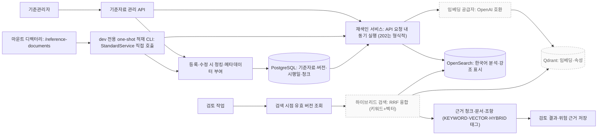

- **여기서 볼 것** — 청킹은 등록·수정 시점에 수행해 PostgreSQL에 저장하고, 검색 가능 상태는 **재색인**(기존 청크 조회 → 임베딩 → Qdrant·OpenSearch 갱신)에서 만들어짐 · 검토는 검색 시점 유효 버전을 사용하고 인용 버전을 결과에 기록 · 재색인은 API 요청 내 동기 실행(worker 소비자 없음) · 임베딩·벡터·RRF 하이브리드 검색은 구현됐으나 임베딩 자격증명·플래그로 게이트(회색), 미설정 시 `INSUFFICIENT`
- **선 읽기** — 실선: 적재·색인·검색 흐름 / 회색: 자격증명·플래그로 활성화되는 임베딩·벡터 검색

- 하이브리드 검색은 OpenSearch(BM25)와 Qdrant(벡터)를 RRF(상수 60)로 융합해 0~1로 정규화
- 정상 검색 조건: Qdrant·OpenSearch 인덱스가 모두 `ACTIVE`, 임베딩 공급자 구성
- 검색기 미구성은 근거 상태 `INSUFFICIENT`로 기록하고, 구성된 검색이 실패하면 키워드 전용·벡터 전용으로 판단하지 않고 `RAG_SEARCH_UNAVAILABLE`/`RAG_SEARCH_FAILED`로 안전하게 실패
- **현재 구현**: RAG 검색 장애는 작업을 재시도하지 않고 근거 상태 `SEARCH_UNAVAILABLE`을 저장한 뒤 job `COMPLETED` + review `CHECK_REQUIRED`로 종료한다(재시도는 `TransientParserError` 경로뿐). **목표 명세**(API 명세·테스트케이스)는 RAG 장애의 재시도·최종 실패 처리를 요구하므로 코드와 명세의 후속 정합이 필요하다

---

## 6. 결과·표시 위치·리포트의 추적성

- **이 그림은** — 판정이 나온 이유를 원본 위치와 기준자료 근거까지 역추적하는 데이터 연결

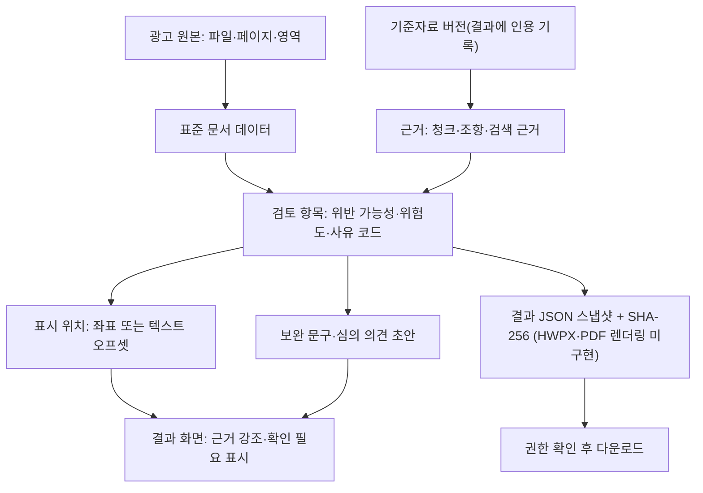

- **여기서 볼 것** — 검토 항목은 원본 위치와 기준자료 근거 양쪽에 연결 · 리포트는 결과 JSON 스냅샷과 SHA-256으로 저장되며, HWPX·PDF 렌더링과 객체 저장은 미구현(다운로드는 스냅샷 바이트를 해당 확장자로 제공)
- **선 읽기** — 실선: 근거·산출물이 파생되는 방향 (점선 없음)

| 산출물 | 사용 목적 | 재현에 필요한 핵심 정보 |
| --- | --- | --- |
| 검토 항목 | 항목별 적합·확인 필요·위험 판정 | 규칙·모델·프롬프트, 인용된 기준자료 버전 |
| 근거 | 판정 근거 제시 | 기준자료 문서·조항, 청크, 검색 결과 |
| 표시 위치 | 원본의 문제 위치 표시 | 페이지·좌표 또는 텍스트 블록·정규화 오프셋 |
| 리포트 | 검토 결과 공유·다운로드 | 결과 JSON 스냅샷·해시, 생성 시각, 접근 권한 (파일 렌더링 미구현) |
| 규정 대화(QA) | 세션·이력 저장까지 구현, 근거 검색은 미연결 | `qa_sessions`를 `review_id`로 연결(마이그레이션 `0010`), 검토별 대화 범위 고정 |

- 결과 화면은 광고 원본 PDF/HWP 미리보기(`pdf_preview.py`·`hwp_preview.py`)를 함께 제공해 표시 위치를 원본과 대조
- 검토별 규정 대화(QA 세션)는 `review_id`로 스코프를 고정하지만, 현재 응답은 근거 검색 없이 고정 안내 문구를 반환하며 인용 기록(`rag.qa_message_evidences`)은 미구현

---

## 7. 데이터 저장소별 역할과 권한

- **이 그림은** — PostgreSQL의 역할(role)별 접근 분리 (업무 계정과 스키마 변경 계정을 구분)

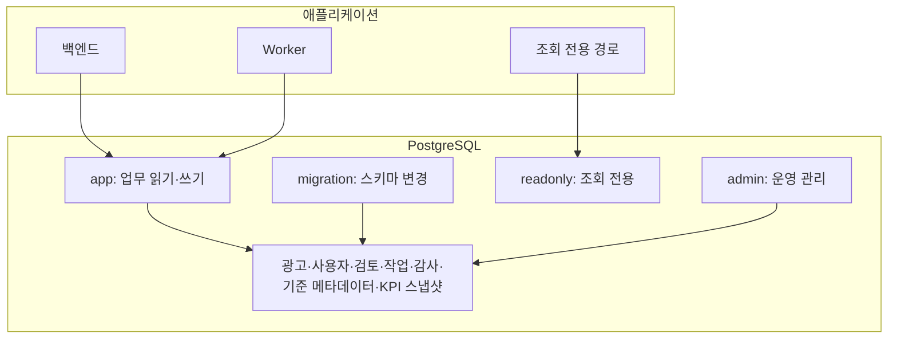

- **여기서 볼 것** — 백엔드와 Worker는 `app` 계정만 사용 · 스키마 변경(`migration`)은 업무 계정과 분리 · 4개 역할 모델 유지
- **선 읽기** — 실선: 계정 사용·테이블 접근 (점선 없음)

- `migration` 계정은 스키마 변경 전용으로 `app` 계정과 분리 (역할 초기화: `infra/postgres/init`)
- ADR-0078(PoC 2계정 운영 프로필)은 역할 모델을 바꾸지 않고, 활성 로그인 시드 계정 수만 2개로 제한하는 운영 제약
- 원본 파일과 문서 처리 원시 산출물은 MinIO 비공개 버킷에 저장
- Redis 메시지는 원본 광고 본문을 제외하고 `jobId` 등 최소 식별자만 포함
- 감사 대상: 등록·수정·삭제·분석 요청·리포트 생성·다운로드·기준자료 변경·핵심 민감 조회

---

## 8. 개발 품질과 외부 AI 검증의 분리

- **이 그림은** — 일반 CI가 검증하는 범위와, 실제 OCR·RAG·LLM 품질을 다루는 별도 수동 평가의 경계

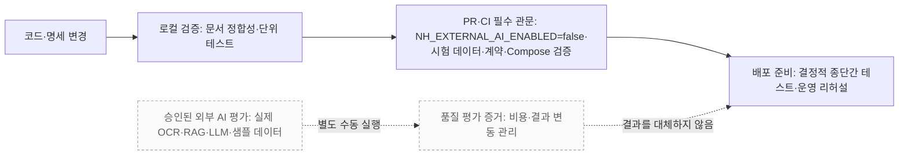

- **여기서 볼 것** — 일반 CI(윗줄)는 플래그를 끈 채 구조화 결과의 저장·조회·표시·리포트만 검증 · 실제 AI 품질(아랫줄·회색)은 자격증명을 갖춘 승인 환경에서 수동 평가하며 CI를 대체하지 않음
- **선 읽기** — 실선: 자동 CI 파이프라인 / 점선: 별도 수동 실행과 "대체하지 않음" 관계

- 파서·OCR·결정적 규칙 검토는 기본 활성이라 CI에서 함께 검증되고, OpenAI Responses·임베딩 등 외부 AI는 `NH_EXTERNAL_AI_ENABLED=false`로 호출하지 않음
- 실제 OCR 판독률, 검색 근거 품질, LLM 판단 품질은 승인된 별도 환경에서 평가
- 고객사 수용 여부는 승인된 샘플 데이터 평가로 확인

---

## 9. 코드베이스 모듈 의존성

- **이 그림은** — "어느 파일을 여는가"를 찾는 지도. 배포 관계가 아니라 코드의 책임과 의존 방향 (코드 존재 기준, 런타임 게이트는 표시하지 않음)

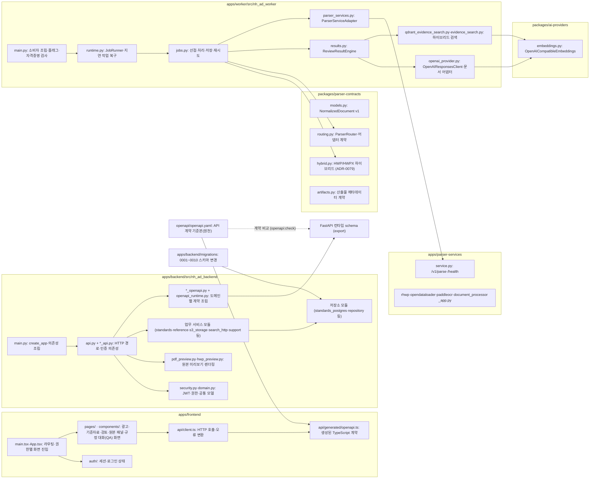

- **여기서 볼 것** — 화면은 생성 타입(`openapi.ts`)을 거쳐 API 계약에 묶임 · 백엔드는 도메인별 `*_openapi.py` 조각으로 계약을 조립 · Worker는 `parser_services.py`로 사설 서비스(기본 활성)를, `qdrant_evidence_search`+`ai-providers`로 검색을, `openai_provider`로 LLM을 호출(외부 AI는 opt-in) · `packages/`는 `ai-providers`·`parser-contracts`·`shared-types` 보유
- **선 읽기** — 실선: 코드 의존 방향 (참조는 화살표 방향으로 읽음)

---

## 10. 백엔드 요청 처리 경로

- **이 그림은** — HTTP 요청이 거치는 미들웨어→경로→인증→서비스→저장소 계층 분리 (새 API 추가나 권한·오류 추적 시 확인)

- HTTP 경로에 업무 로직을 직접 넣지 않음
- 인증·인가·업무 서비스·저장소의 책임 분리

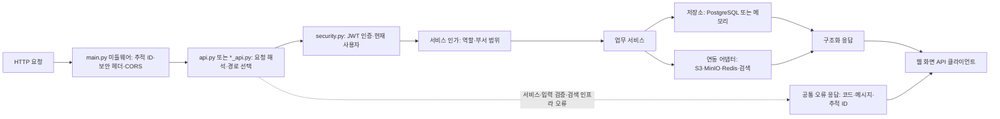

- **여기서 볼 것** — 인증은 `security.py`, 인가(역할·부서)는 서비스 계층에서 분리 · 모든 오류는 추적 ID를 포함한 공통 오류 응답으로 수렴
- **선 읽기** — 실선: 정상 요청 처리 흐름 / 점선: 오류 발생 시 공통 오류 응답 경로

---

## 11. Worker 내부 실행과 실패 경로

- **이 그림은** — Redis 최소 식별자 메시지의 선점→처리→저장 흐름과 재시도·최종 실패 대기열 분기

- 기본 구성은 사설 파서 서비스를 호출해 정규화·규칙 검토까지 수행(`NH_PARSER_SERVICES_ENABLED=true`)
- 외부 AI 자격증명이 켜지면 하이브리드 검색·LLM 보조가 추가되고, 파서 서비스를 명시적으로 끄면 `PARSER_ADAPTER_NOT_CONFIGURED`로 fail-closed

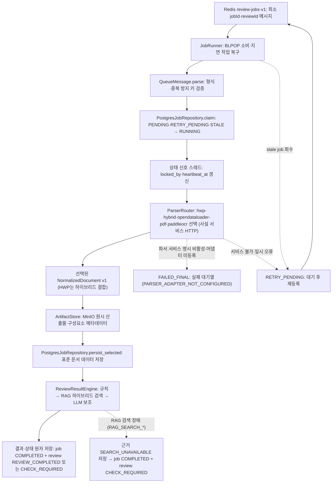

- **여기서 볼 것** — 정상 경로(위→아래)는 선점→상태신호→파싱→산출물→저장→결과이며 기본 구성에서 여기까지 동작 · 점선은 실패 분기 · `PARSER_ADAPTER_NOT_CONFIGURED`는 파서 서비스를 명시적으로 껐을 때만 발생 · RAG 검색 장애는 `RAG_SEARCH_UNAVAILABLE`/`RAG_SEARCH_FAILED`, LLM 단계는 규칙 결과를 지우지 않는 보조(advisory)
- **선 읽기** — 실선: 정상 처리 순서 / 점선: 실패·재시도 분기 (`FAILED_FINAL`=영구 실패, `RETRY_PENDING`=재시도)

---

## 12. API 계약 전파와 검증 경로

- **이 그림은** — API 변경 시 `openapi.yaml`을 시작점으로 타입·문서·계약 테스트를 함께 갱신하는 경로

- API를 바꿀 때 구현 파일만 단독으로 수정하지 않음
- 백엔드는 도메인별 `*_openapi.py` 조각과 `openapi_runtime.py`로 계약을 조립 (도메인 소유권 정렬 리팩터링)
- 함께 갱신할 대상: 원천 OpenAPI, 백엔드 생성 OpenAPI, 웹 화면 생성 타입, Markdown 명세, 계약 테스트

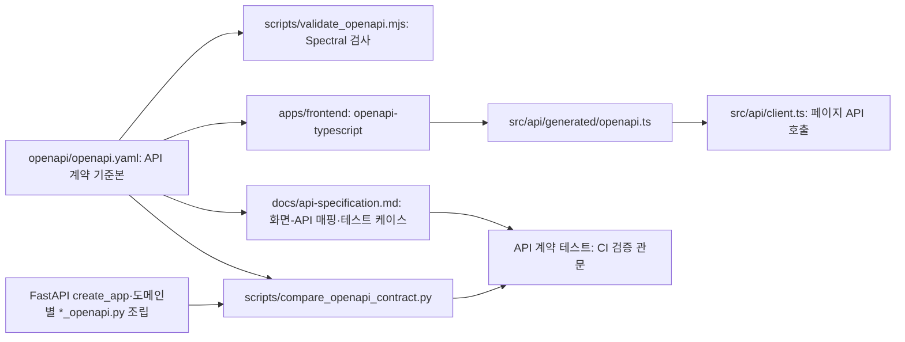

- **여기서 볼 것** — `openapi/openapi.yaml` 하나에서 프론트 타입·문서·계약 테스트가 갈라짐 · 백엔드가 도메인 조각으로 생성한 OpenAPI와 원천을 대조(`compare_openapi_contract.py`)하는 것이 CI 관문 · 검증 스크립트는 저장소 루트 `scripts/`에 위치
- **선 읽기** — 실선: 계약 전파·검증 흐름 (점선 없음)

### 코드 탐색용 다이어그램 요약 (§9~§12)

| 다이어그램 | 주 사용 시점 | 빠르게 찾을 것 |
| --- | --- | --- |
| §9 모듈 의존성 | 신규 개발자 온보딩, 기능 담당 파악 | 기능별 진입점·소유 모듈 |
| §10 백엔드 요청 경로 | API 추가, 권한·오류 분석 | 경로·서비스·저장소·어댑터 분리 |
| §11 Worker 실행·실패 | 작업 실패, 재시도, 문서 처리 연동 | 상태 갱신·실패 대기열 책임 |
| §12 API 계약 전파 | API 변경 PR | 동반 갱신·검증 파일과 관문 |

---

## 13. 상세 확인 문서

- 프로젝트 전체 상태와 진입점: `README.md`
- 기능 흐름과 예외 처리: `docs/functional-specification.md`
- API 계약: `openapi/openapi.yaml`, `docs/api-specification.md`
- 저장 모델과 인덱스: `docs/database-specification.md`
- Compose 환경 분리: `docs/adr/ADR-0063-compose-base-dev-prod-override-policy.md`
- 비동기 Job 상태: `docs/adr/ADR-0035-redis-queue-postgresql-job-state.md`
- 문서 처리·OCR 어댑터: `docs/adr/ADR-0014-pluggable-document-parser-ocr.md`
- 파서·OCR 엔진 라우팅과 HWP 하이브리드: `docs/adr/ADR-0079-hwp-hwpx-hybrid-parser-composition.md` (ADR-0072 대체)
- 파서 서비스와 외부 AI 활성화 분리: `docs/adr/ADR-0081-parser-service-and-external-ai-activation-separation.md`
- 자체 호스팅 러너 Compose 자동 배포: `docs/adr/ADR-0080-self-hosted-runner-compose-cd-policy.md`
- 개발 기간 기본 브랜치 dev·Notion 동기화 소스: `docs/adr/ADR-0082-development-default-branch-dev.md`, `docs/adr/ADR-0083-development-notion-sync-source-dev.md`
- 규칙·RAG·LLM 책임과 근거 선택: `docs/adr/ADR-0013-rule-rag-llm-responsibility.md`, `docs/adr/ADR-0043-rag-evidence-selection-policy.md`
- PoC 운영 계정 프로필: `docs/adr/ADR-0078-poc-two-account-operation-profile.md`
- 실제 AI와 시험용 데이터 테스트의 경계: `docs/adr/ADR-0044-ai-mock-fixture-test-policy.md`
