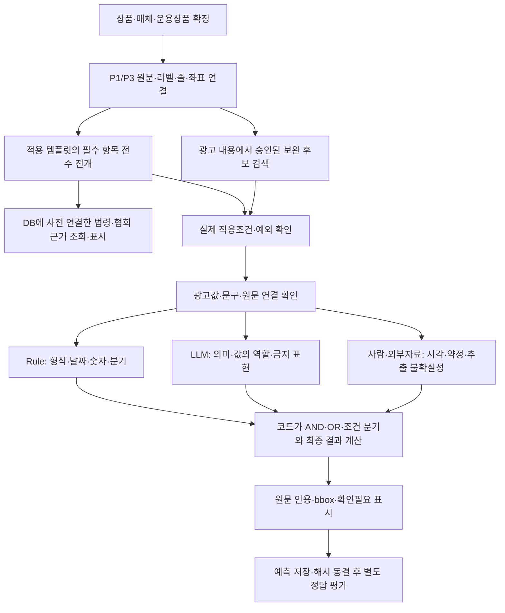

# 심의 흐름과 규칙·구조화 작업 기준

## 파서 후처리 검증·운영 반영 — 2026-09-29

실제 P1/P3 6건(최신 HWP1·과거 HWP1·PDF1·이미지3)을 후보 이미지에서 읽기 전용으로 재연결했고 원본 줄·문자를 보존했다. 레이아웃 누락은0이며 통합 입력6개와 검색 문서334개가 스키마 검사를 통과했다. 최신 HWP는29줄→영역7개·검색 세부18청크다. 과거 산출물을 현재 파서로 다시 파싱한 결과는 아니며 신규 금융 판정·gold 읽기를 실행하지 않았다. RAG unittest627건·함수21건, Linux 문서 일관성·거버넌스82건이 통과했다.

농협 심의 사이트의 현재 웹은 `nh-operational:1118-semantic-r18`, 이미지 SHA `sha256:ccade7f9bb0e87575da9a7966462e9c0725b766bf22c2bc340d76e66616bd246`이며 healthy·실행 중0이다. 웹만 갱신했고 광고21건·심의35건·저장 결과22개의 ID와 결과 파일 해시가 그대로다. 정본 결합 SHA는 `281e2010bf5e624bd12488c2e9595d270bddefd55962d411fb6a82025da1ad16`, source-manifest SHA는 `b70627c9536add0366947d74f41e37a939c2397998d05e8b75dfb1585ff245c4`다. 템플릿239개·보완0개 컴파일과 승인 입력 해시를 확인했다. 새 브라우저의 오류·데이터 변경 요청은0건이다.

줄 배치33개 원자는 사람 담당이며 이번 배포에서 자동 판정으로 전환하지 않았다. 원본 개행 청킹·좌표 출처 전달·줄0개/영역 bbox 계약 일치는 반영했다. 검색 청크나 문자 대응 성공을 물리 줄·유의사항 의미 경계 검증으로 해석하지 않는다. 기존 심의 결과와 gold는 변경하지 않았다.

## 원문 해석 정정의 실행 검증·배포 — 2026-09-29

사용자가 확인한 마스킹 연락처 인정과 퇴직연금 예시 숫자 비구속 기준을 정본·어휘 질의·압축 모델 입력·코드 종합·사이트 작업대장에 함께 반영했다. 이름·상담사 연락처·상담사 등록번호의 AND를 유지하며 마스킹만을 새로운 필수 형식으로 만들지 않는다. 퇴직연금 수치의 역할·단위·안내 의미는 유지하고 예시와 다르다는 이유의 전역 적정 보류를 제거했다. 손해배상 원문 ‘선입’은 원본 HWPX Contents/section0.xml#table4/row13 그대로 보존한다.

RAG unittest622건·함수 검사21건이 통과했다. 실제 Gemma에서 마스킹 번호2형식과 예시와 다른 퇴직연금 수치2건의 명확한 합성 입력은4건 모두 예상 판정·출력 계약·인용 줄/bbox 연결을 통과했다. 기대 판정은 모델 입력에 넣지 않았다. 앞선 합성의 모호한 성명 표현은 성명 원자가 누락으로 관찰돼 위반이었으며, 연락처 원자는 이미 충족이었다. 그 기록을 보존하고 역할을 명시한 별도 합성으로 두 연락처 형식을 다시 검증했다. 이 결과를239개 전체의 의미 검수나 실제 광고 정확도로 주장하지 않는다.

과거 r17 검증 시점의 Spark 1118 웹은 `nh-operational:1118-semantic-r17`, 이미지 SHA는 `sha256:4effbeb1f9b69861c26d629d2e7066544a1fac0b052d17fb30eeea3a62caeae2`이며 healthy·실행 중0이다. 웹만 교체했고 광고21건·심의35건·저장 결과22개의 ID와 파일 해시가 배포 전후 같다. 정본 결합 SHA는 `281e2010bf5e624bd12488c2e9595d270bddefd55962d411fb6a82025da1ad16`, source-manifest SHA는 `2eb36f6590658d8f3e8c0d44592b1f0cc342b36dee091969498355cd7f46068d`다. 실제 HWPX와 승인 ISA 방법론3개 파일 SHA 및 컴파일 템플릿239개·보완0개를 검증했다. 새 브라우저에서 수정된 마스킹 의미·AND·퇴직연금 적정 허용·원문 선입 보존을 확인했으며 데이터 변경 요청/페이지 오류는0건이다. 검증 자료는 무시되는 temp/source-clarification-20260929/ 및 temp/semantic-preparation-20260928/에 보존한다. 보완32·추가34는 운영 비활성이며 커밋·푸시하지 않았다.

## 사용자 해석 확정 — 2026-09-29 연락처와 퇴직연금 예시 숫자

전화번호는 광고 원문에서 연락처 역할로 기재됐는지 확인한다. `00-0000-0000` 등 마스킹 표기도 연락처 기재로 인정한다. 실제 번호 여부·전화 가능성·정확한 자릿수나 구분자 형식은 필수 조건으로 만들지 않으며 특정 마스킹 예시와의 완전일치도 요구하지 않는다.

퇴직연금 예시의 `16.5%`·`1억원`은 고정 검사값이 아니다. 세율·개인 보호한도 등 해당 숫자의 역할·단위·안내 의미를 원문에서 확인한다. 예시 숫자의 구속 범위를 묻는 공통 C 조건으로 전체 적정을 보류하지 않는다. 필요한 판독·역할·단위·안내 의미가 불명확한 원자는 미확정으로 유지한다.

대출모집인 손해배상 안내의 ‘선입’은 원본 HWPX `Contents/section0.xml#table4/row13`에 실제 존재한다. 오기 교정은 승인되지 않았으므로 원문과 출처를 보존하고 다른 단어로 자동 치환하지 않는다. 이 사용자 해석을 반영한 r17의 실행 검증·배포와 상태 보존 영수증은 [인수인계 정본](handoff-current.md)의 최신 절에 기록한다. 아래 r16 검증·배포 정보는 과거 이력이며 r17 성공 기록이 아니다.

## 후속 작업의 적용 범위 — 2026-09-29

대출모집인 나머지16행과 상세 심의방법/인접 템플릿37행을 기존 정본에 추가로 구조화한다. 원문53행의 명확한 의미를 분해하되 공란·조건 없는 의무·대안·사람/외부 담당을 보존한다. 원문 해석을 추측해야 하는 부분은 같은 항목의 확인 필요로 남긴다. 대출 금리 산식·기준일·한도 비교는 동일 범위의 직접 원문과 코드 계산을 사용하고 단순 기재/의미 검사는 LLM의 인용 관찰을 코드가 종합한다.

퇴직연금2항목은 숫자의 역할·단위·안내 의미를 확인하되 `16.5%`·`1억원` 예시 고정값 비교와 전역 C 보류를 사용하지 않는다. 전화번호 마스킹 표기를 연락처 기재로 인정하고 대출모집인 ‘선입’은 원본에 존재하는 문언으로 보존한다. 보완32·추가34는 템플릿과 공유 가능한 검사·잔여 검사·시각·허용 정책·범위/판본 확인으로 준비하며 최종 선정 승인과 운영 활성화는 구별한다. 추가34는 기존32가 잘못 뽑혔음을 의미하지 않으며 전체 규제목록의 완전성을 보장하지 않는다. 구조화가239개 전 항목의 의미 검수 완료를 뜻하지 않는다.

과거 r16 검증 기록: RAG unittest618건·함수 검사21건, 문서0오류0경고, Linux 거버넌스82건과 문서 정합성 검사 통과다. 당시 실제 Gemma 합성8건은6건 예상 일치·2건 미확정이며8건 모두 출력 계약과 인용 줄/bbox 연결을 통과했다. 두 미확정(ELB 일반 손실 문구의 신용위험 의미, 정상 대출 산식의 등급 인용)은 모델 관찰·인용 개선 대상으로 남기며 금융 기준 승인 질문이나 정확도 통과로 바꾸지 않는다. 앞선 복합 분기 재검토 실험의 잘못된 적정은 운영에 반영하지 않았고 단순 기재 항목에만 재검토를 허용한다. 이 기록은 새 r17 검증 결과가 아니다.

과거 r16 배포 기록: 당시1118 웹은 `nh-operational:1118-semantic-r16`이며 이미지 SHA는 `sha256:6ee983889f041822b7b933bd1def9128a02367b74807087f53f451821775b74b`이다. healthy·실행 중0, 광고21건·심의35건·저장 결과22개의 ID/해시가 배포 전후 같다. 웹만 교체했고 파서·모델·ES·원문·이전 결과는 보존했다. 정본 결합 SHA는 `653ba91770e5941ba7985646b8b20c610fb0c35c5fb506b9ca03f88d4bb92dc6`, source-manifest SHA는 `e739eb7fab75b73ad41a49747c31455853e9c301acc93c8132850cacc6b8147d`다. 실제 HWPX와 승인 ISA 방법론3개 파일 SHA를 후보 검증부터 배포까지 대조했다. 새 브라우저에서 작업대장200·갱신 원자·명시 후취·당시 수치 해석 보류·현행 출처·AND 표시를 확인했고 변경 요청/페이지 오류는0건이다. 농협 심의 사이트 접속은 `http://127.0.0.1:5182`이며 구조화 기준 열람은 `/review-criteria`다. 커밋·푸시하지 않았다. r17 배포 완료 기록이 아니다.

## 용어와 확인 범위

사이트 이름은 **농협 심의 사이트**다. **Spark 1118**은 실행 서버 이름이며 사이트 이름으로 사용하지 않는다.

템플릿에 연결된 근거법령과 광고에서 판단에 사용하는 원문을 구별한다. 사용자는 `NH_상품별_심의기준_근거통합 (19 ｜8).xlsx`처럼 템플릿별 근거법령을 미리 연결해 DB에 적재할 계획이다. 해당 파일의 법령·조문상세·협회 규정·본문상세 열을 확인했다. 런타임에 새 법령을 검색해 붙이는 단계는 필요하지 않다. 현재 loopback 운영은 JSON 정본이며 이 계획에 따른 DB 적재가 완료됐다고 표시하지 않는다.

아래의 광고 확인은 법령 검색이 아니다. 파서가 받은 실제 문구·금리·조건·단위가 어떤 검사에 쓰이는지 확인하는 것이다. 법령 연결만으로 광고의 최대금리나 조건별 금리를 알 수는 없다. 광고 입력을 조회하는 구현과 필수 항목 선정도 구별한다. 이번 용어 정정은 기존 광고 근거 회수기의 동작을 제거하거나 보완 규칙을 활성화하는 변경이 아니다.

## 전체 흐름



기존 구현의 양방향 검색 중 광고→규칙은 내용에 따른 보완 후보의 **발견**이며 선택 범위 밖 규정을 가져오지 않는다. 규칙→광고는 이미 선정된 검사가 사용할 **광고 입력 조회**다. 법령 연결 검색을 의미하지 않는다. 현행 template-only에서는 보완 발견 단계가 비활성이며 광고 입력 조회는 실행된다. 기본 필수 항목은 검색과 관계없이 모두 전개한다. 사용자에게 보여 주는 전체 흐름에서는 이 단계를 ‘광고값·문구·원문 확인’으로 표현한다.

라벨·어휘 근거를 기본으로 쓰고, 원문 표·각주·인접 문맥과 trigger evidence를 보존한다. 라벨은 증거 후보이며 회사명·상품명·가입대상도 실제 원문과 역할을 확인한다. 파서의 confidence는 검증된 정확도 확률로 간주하지 않는다. 필요한 영역이 불확실하거나 전체 판독이 불완전하면 누락을 자동 확정하지 않는다. 임베딩은 동일 검사·같은 광고 범위·동일 예산으로 어휘 기준선과 비교한 뒤 유용성이 확인된 항목에만 보조로 승격한다. 현재 항목별 비교 결과는 없다.

Rule과 LLM은 항목 전체를 양분하지 않고 원자 검사마다 함께 배치할 수 있다. 예컨대 LLM이 수치가 기본금리·우대금리·세율 중 무엇인지 인용과 함께 구분하고, 코드는 단위·완전성·산식·기간을 검증한다. 회사명도 라벨에 잡힌 값을 그대로 적정으로 만들지 않는다. 모델이 전체 결론을 임의로 합치지 않으며 확인 불가를 조건 없음으로 치환하지 않는다.

## 기본 19종과 상세 심의방법

19종은 원문 템플릿의 상품 유형 수다. 현행 실행의 239개 항목·17개 선택 유형과 같은 수가 아니다. 기본 템플릿의 카드성은 현재 지원하지 않고, ETF·ELB 상세방법은 기본 19종 밖의 퇴직연금 운용상품 기준이다. 퇴직연금 공통 기준과 실제 광고에 언급된 펀드·ETF·ELB 기준을 함께 적용한다. IRP는 현재 원문의 별도 유형을 유지하며 ETF·ELB·단독 펀드까지 임의 확대하지 않는다.

기본 템플릿은 다음 순서로 읽는다.

1. 구분·필수여부·기재요령·출처 행을 보존한다. `O`는 선택 범위 안의 필수 항목이다. 내용 발동조건을 새로 만들지 않는다.
2. `△`는 기재요령에 적힌 실제 조건·예외만 구조화한다. 조건이 불명확하면 확인필요다.
3. 기재요령의 요구를 기재·의미·금지·대안·수치 비교 등 검사로 나눈다. 의무가 없는 확인전용 항목에는 검토 질문만 둔다.
4. 예시는 의미 해석·검색 힌트다. 예시 숫자·상품명·문장의 완전일치를 요구하지 않는다. 판단기준이 예시 외에는 부족한 부분은 해석 확정 작업으로 남긴다.
5. 상세방법이 있으면 적정·부적정·확인필요 기준을 **별도 역할**로 보존한다. 안내문구는 결과에 따른 안내이며 추가 의무로 복사하지 않는다.
6. 기본과 상세가 충돌하면 판본·승인 이력을 대조하고 미확정으로 남긴다. 법령 연결은 출처 표시이며 새로운 의무 생성 수단이 아니다.

기재요령이 비어 있는 행은 다음과 같이 처리한다.

| 원문에 남아 있는 정보 | 구조화할 수 있는 범위 |
| --- | --- |
| 상세방법에 일반 적정·부적정·확인필요 기준이 있음 | 같은 상품·항목·판본에 연결되는 해당 기준으로 검사 구성 |
| 필수 O와 명확한 점검항목만 있음 | 해당 정보가 실제 역할을 갖고 기재됐는지 검사. 수치·문장 형식·내용 적정성 조건은 추가하지 않음 |
| 필수 △인데 실제 적용조건이 없음 | 조건 해석 확정 전 적용성 보류. 모델이 조건을 만들어 내지 않음 |
| 예시만 있거나 판단 의미 자체가 불명확함 | 해석 확인 작업으로 남김. 예시 완전일치나 연결 법령의 자동 의무 승격으로 메우지 않음 |

세부 기재요령이 없어도 명확한 기재 의무는 구조화할 수 있다. 다만 ‘기재를 확인했다’와 내용·시각·외부자료까지 모두 적정하다는 결론은 구별한다. 기존 32개·추가34개 보완 규정은 별도로 승인한 검사 출처가 될 수 있으며, 템플릿에 연결된 법령을 자동으로 그 범위에 추가하지 않는다.

구조화 카드에는 출처·적용 범위·필수여부·판단 유형·실제 조건·검사·허용 결과·Rule/LLM/사람 담당·필요 입력·근거 확보 방식·AND/OR/분기·불확실성 처리·양성/음성/경계 검증을 둔다. 먼저 이 의미 구조를 정하고 검사별 라우팅을 정한다. 원문 해석이 부족한 카드에는 빈칸을 추측으로 채우지 않는다.

예를 들어 회사명은 `선택 범위 → 회사 식별 의미가 원문에 존재하는지 → 라벨·어휘로 후보 확보 → 주체와 인용 검증`이다. 금리 방식은 서로 다른 방식의 일부를 섞지 않고 원문이 허용한 완전한 대안 하나를 확인한다. 한 줄 복수 유의사항은 `문구 의미 확인`과 `서로 다른 유의사항의 실제 줄 배치 확인`을 분리한다. 문장 수·마침표 수·bbox 존재만으로 서로 다른 유의사항 수를 확정하지 않는다.

## 자연어를 단계·분기·AND/OR로 옮기는 방식

사용자가 제시한 입출식 우대금리 문장은 상세방법의 `MTH-DEPOSIT-DEMAND-R10` 적정 기준에 있다. 이 방식으로 규칙화하는 것이 목표다. 자연어 문장을 그대로 하나의 모델 질문으로 남기는 데서 끝내지 않고, 적용 범위·사실·개별 검사·대안·결과 종합으로 나눈다.

아래는 검토하기 위한 의미 전개다. 새 런타임 규칙을 추가한 결과가 아니다.

```text
적용 범위: 이 상세방법을 적용하는 상품·광고인가?

A = 우대금리 없는 상품임이 확인됨
    AND 참조 C7의 방식1 요건을 충족함
B = 조건별 우대금리 표기 방식임
    AND 같은 상품·기간·단위와 전체 합계 대상을 확인할 수 있음
    AND 최대 우대금리 ≤ 조건별 우대금리 합
C = 여러 조건 중 n개 이상 충족 시 우대 제공 방식이며,
    대상 상품의 조건과 우대 제공 내용이 원문에서 확인됨

적정 대안 = A OR B OR C
```

광고의 조건과 수치가 원문에 어떻게 적혔는지는 LLM과 원문 검증이 관찰하고, 확인된 사실의 AND/OR·분기와 산술 비교는 코드가 계산한다. C7은 원문 Excel 참조이므로 어느 금리 방식의 어떤 요건을 가리키는지 같은 판본에 고정해야 한다. 방식1이라는 이름만으로 충족하지 않는다.

광고에 우대금리 문구가 없다는 사실을 ‘상품에 우대금리가 없다’로 치환하지 않는다. 확인되지 않은 사실은 UNKNOWN이다. 유효한 대안 하나가 충족되면 적정이며, 부적정은 적용성·판독 범위·대안 평가가 확보되고 원문이 허용하는 위반 조건이 확인된 경우에만 계산한다. 모든 대안을 증명하지 못했다는 이유만으로 위반을 만들지 않는다.

R10은 n개 이상 방식 OR 최대 우대금리 합 비교 OR 확인된 상품 무우대·기본금리 방식의 대안을 실행한다. 합 비교는 외부 미확정 분기에 막히지 않는다. 광고에 우대 문구가 없다는 사실과 상품 자체에 우대금리가 없다는 외부 사실을 구별한다. R11은 최고금리/범위 방식의 생략과 기본금리 방식의 우대 적용금액을 원자 분기로 전개했다. 최고금리 적용한도와 공통 금리 표시도 해당 방식에서 확인한다. 외부자료 없는 상품 무우대 분기는 미확정이며 최대금리 합 계산기는 지원 표현에 한정된다. n개 이상 방식은 LLM 의미 검사이며 별도 수치 검증기를 구현한 상태가 아니다. 전체 우대금리 표현을 의미 검증 완료했다고 표시하지 않는다.

다음 검토에서는 각 대안의 입력값과 원문 인용, 양성·음성·경계 예시를 함께 정한다. 예를 들어 합계를 만족하는 경우·초과하는 경우·우대 없는 상품·n개 이상 방식·추출 불명확을 서로 구별한다. 구조를 먼저 검토하고 원자 검사별 Rule/LLM/사람 담당을 결정한다.

## 파서와 심의 서비스의 처리 경계

파서 담당자가 헤더·푸터 제외와 광고 한 건의 복수 파일 의미 통합은 아직 구현하지 않았다고 알렸다. 최신 파서의 범용 완료 기능으로 주장하지 않는다.

- 심의 측에는 파서가 명시한 header/footer/navigation 역할을 사용하는 코드가 있다. 역할이 없으면 페이지 상하단 위치만으로 광고 내용을 제외하지 않는다. 이 코드의 존재가 새 파서의 역할 분류 완료를 뜻하지 않는다. 회사명·필수 고지 등이 공통 영역에 있다는 이유로 무조건 버리지도 않는다.
- 심의 측 merge_asset_documents는 각 파일을 파싱한 뒤 파일 ID·원본 페이지·줄/영역 ID·해시를 구별해 한 광고의 입력 묶음으로 합친다. 파서가 복수 파일을 한 상품으로 해석하거나 중복·상충·상품 관계를 해결한 결과가 아니다. 실제 복수 파일 광고에 대한 최신 파서 의미 통합 완주도 이번 검증 범위에 없다.

## 문서와 실제 구현의 상태

| 구분 | 현재 상태 |
| --- | --- |
| 최신 P1/P3 어댑터·CLI·HWP 화면 연결 | 운영 반영 및 실제 HWP 한 건 검증 |
| 적용 항목 전개·분기·AND/OR·일부 수치 계산의 공통 실행 틀 | 운영 연결됨 |
| 퇴직연금 복수 운용상품 선택·로고 예외·줄 배치 검사 분리 | 기존 운영 반영 범위 |
| 239개 모든 자연어의 조건·예외·대안별 의미 검수 | 완료 아님. 검토표로 계속 확정 |
| 보완32·추가34 | 검토·구조화 작업 범위. 운영 자동 판정 비활성 |
| 템플릿별 법령 DB 적재 | 사용자 계획. 현재 운영에서 완료 확인한 상태 아님 |
| 새 파서의 헤더·푸터 분류와 복수 파일 의미 통합 | 파서 담당자 미구현 안내. 심의 측 기술 처리와 구별 |

이 문서는 이미 반영한 공통 틀과 이제 확정할 항목별 기준을 함께 설명한다. 문서에 적혀 있다는 이유만으로 전 항목의 규칙화·구조화가 끝났다고 해석하지 않는다.

## 보완 32행과 추가 34행의 선정

규제목록 256행을 자동 심의로 복원하지 않는다. 기존 32행과 추가 후보 34행을 출처 검토 작업대장에 모으고 나머지190행의 분류·제외 이유도 보존한다. 선정 단위는 원문 행이며 최종 검사 수가 아니다. 템플릿과 같은 검사는 공유하고 남는 검사만 보완한다.

선정 계보는 기존 전역 미매핑192행→우선 조건부42행→은행 템플릿 관련 후보29행에 세부상품2행·시각1행을 보정한32행이다. 당시부터32행은 완전 목록이 아니라 우선 선정 범위였다. 추가34행은 새 규정이 아니라 같은192행에서 근거 분리 대기6·세부상품 조건부 대기16·시각/표시형식10·범위 보류2행을 후속 원문 대조 대상으로 꺼낸 것이다. 후속 감사는 v2의256행을 범주화하고24행 우선 검토·3행 잔여 결합·7행 시각 검토로34행을 저술했다. 전체 행의 범주 누락을 확인한 것과 지원 범위의 모든 의미 검사를 완성한 것은 구별한다. 기존32의 완전성도 추가34의 완전성도 확정하지 않는다.

| 추가34행 처리 | 행 수 | 방향 |
| --- | --- | --- |
| 잔여 내용 검사 | 19 | 펀드 위험등급·환매·보수 등 템플릿이 덮지 않는 검사 구조화 |
| 기존 검사 공유 + 잔여 | 3 | 경제적 이해관계·대가·수상 정보의 기존 사실 공유 |
| 사람 시각 검토 | 7 | 글자 크기·근접·균형·도안 크기; 검증된 입력 없이 자동 위반 금지 |
| 매체 정책 | 1 | 배너 표시 위치·예외를 결합 정책으로 표현 |
| 지원 범위 보류 | 2 | 공동광고 부보기관·계열사 채무보증 관계 |
| 판본 확인 보류 | 2 | 퇴직연금 성과 기간·특별이익 기준 |

기존32행은 추가 의무 후보22·중복/복합7·시각2·허용 정책1로 나눈 이전 검토를 유지한다. 특히 공통 문구 허용은 독립 위반 규칙으로 만들지 않는다. 사례 원문에만 의존하는 근거, 승인 ISA 수수료와 충돌하는 구판, 성과 대상·금리 방식 충돌은 승격 전 확인한다. 현재32만으로 충분하다고 확정하지 않으며 34행 모두를 새 자동 의무로 만들지도 않는다.

기존32·추가34는 **구조화 작업 범위**로 확정한다. 원자 기준·직접 적용 범위·판본·예외·필요 입력이 미확정인 검사는 자동 판정에 켜지 않는다. 작업대장은 사이트와 검토표에 연결되지만 런타임 검색·판정은 정본 실행 계획·disposition gate만 사용한다. 이 구분은 만든 구조를 몰래 옛 실행기로 우회시키는 것을 허용하지 않는다.

## 이번 운영 수정의 범위

퇴직연금 공통과 복수 운용상품 선택을 입력→상품별 범위→정본 전개→확정 사실→coverage 감사까지 연결했다. ETF·ELB 비보호2항목의 본문과 로고 예외를 분리했다. 줄 배치33항목을 별도 사람 확인 검사로 분리해 텍스트만으로 전체 적정을 확정하지 못하게 했다. 239개 프로그램의 근거 정책을 라벨/어휘 또는 어휘로 명시하고 노드 검색에도 적용한다.

사이트 `/review-criteria`는239+32+34의 원문·담당·작업 상태를 열람한다. 원문19종·상세방법·현행 정본의 관계 설명과 작업 Excel은 별도 deliverables에 있다. 이 작업은 전체305행의 의미 검증 완료나 보완 자동 활성화를 의미하지 않는다. 과거 결과·상태·정답 격리는 유지한다.

Spark 1118의 `nh-operational:1118-structure-r10a`에 농협 심의 사이트를 배포하고 새 브라우저에서 실제 입력·작업대장을 확인했다. 이는 이 절의 최초 배포 기록이며 현행 이미지는 인수인계 상단을 따른다. 광고21·심의35·저장 결과22개의 ID와 해시는 보존됐다. [배포 검증](handoff-current.md)에 이미지·테스트·상태·브라우저 증거와 한계를 기록한다. 이번 설명 정정은 운영 코드·판정 결과·Accepted ADR을 변경하지 않는다.

## 문서 현행 정보

| 항목 | 내용 |
| --- | --- |
| 현행 버전 | v1.8 |
| 기준일 | 2026-09-29 |

## 변경 이력

| 버전 | 기준일 | 변경 내용 |
| --- | --- | --- |
| v1.8 | 2026-09-29 | 대체된 설계·배포 보고서 참조를 현행 실행 계약/인수인계로 정리 |
| v1.7 | 2026-09-29 | 파서 후처리·논리 본문 청킹·좌표 출처 전달 검증과 r18 상태 보존 배포 |
| v1.6 | 2026-09-29 | 연락처 마스킹·퇴직연금 예시 숫자 해석 확정과 전역 C 보류 제거·선입 원문 보존·r16 이력과 r17 최종 검증 구별 |
| v1.5 | 2026-09-29 | 후속53행 의미 실행·수치 비교·66행 원문 대조와 필요한 해석 범위 |
| v1.4 | 2026-09-28 | 입출식 우대 합·기본금리 분기·최고/범위 표시의 생략 조건 실행 반영과 외부자료 지원 경계 |
| v1.3 | 2026-09-28 | 기존32의 우선선정 계보와 같은 미매핑192행에서 나온 후속34행의 기준·완전성 한계 명시 |
| v1.2 | 2026-09-28 | 농협 심의 사이트/Spark 명칭·법령 조회와 광고 확인·빈 기재요령·우대금리 분기·파서 미구현 경계 정정 |
| v1.1 | 2026-09-28 | 1118 r10a 배포·상태 보존·실제 브라우저 검증 연결 |
| v1.0 | 2026-09-28 | 심의 흐름·양방향 검색·19종 구조화·66행 선정 및 실제 운영 연결 범위 기록 |
